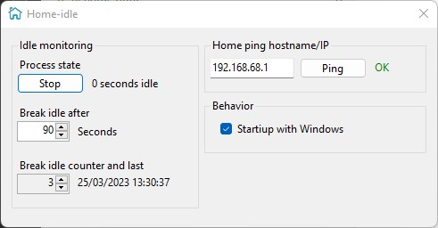
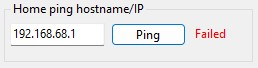
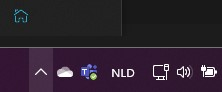

# Home-Idle

App that keeps Windows from going idle when there is no user activity on your desktop, like no mouse movement or keyboard usage.

The idle state will only be broken when you are home, and where it's safe to leave the computer unattended. The app stores the last process state (stopped or running) and other settings.

## Features

- Define your "home" location by configuring a ping test to a home device, such as a printer or Wifi access point. The break of the idle state only happens when the last ping state is OK.

  

  

  Use `127.0.0.1` when you don't care about security.

- The app will reside in the [notification area](https://learn.microsoft.com/en-us/windows/win32/shell/notification-area) when minized.

  

- You can control the maximum wait interval before the app will break the idle state of Windows with the `Break idle after` value in seconds.

- The last idle break timestamp and counter since the app started can be consulted.

- Control for your user only the auto-run behavior of the app with the checkbox.
